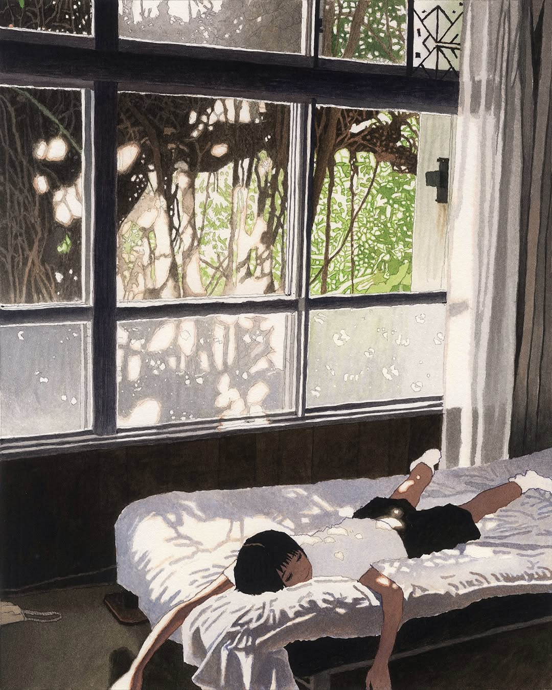
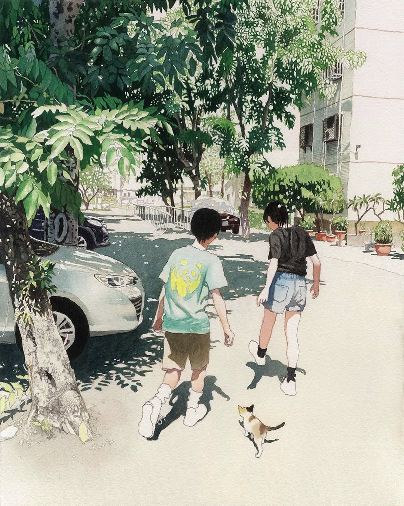
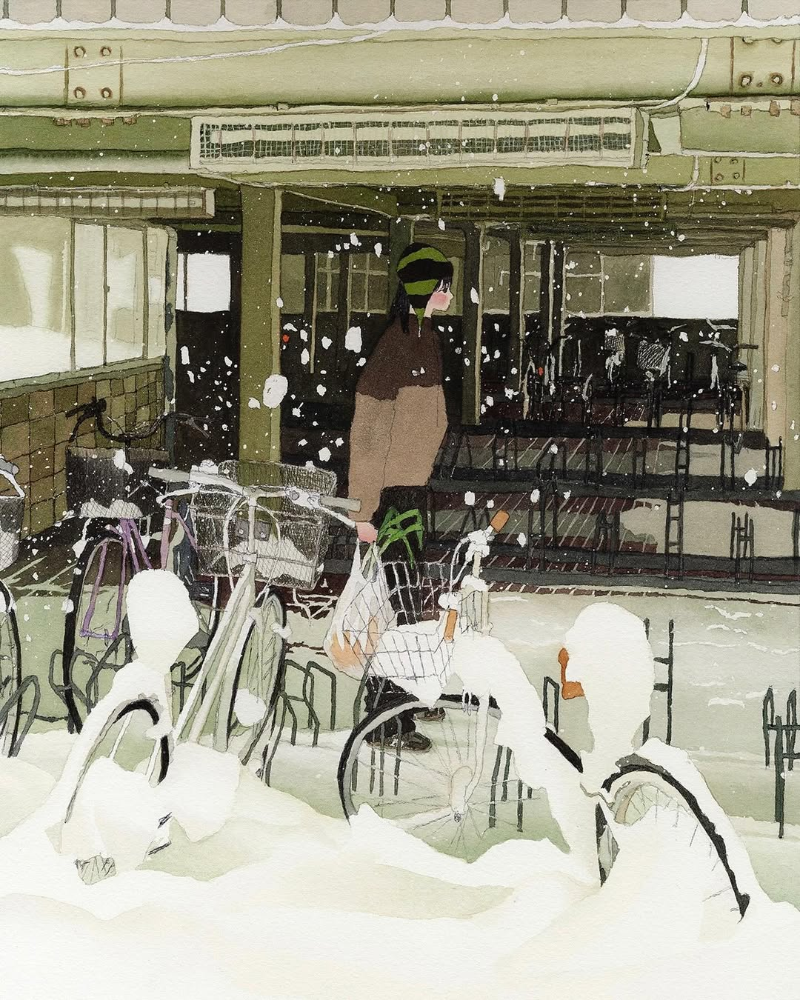

# 디자인 의도 설명서

## "추억의 재구성" 성률 작가 개인전 온라인 전시회

---

## 1. 공간 연출 (레이아웃)

**자동 순환 캐러셀**: 5개 작품이 4초씩 자동 순환하는 캐러셀을 최상단에 배치하여 강력한 첫인상을 제공합니다. 중앙-좌우-숨김 구조의 3단계 레이어링과 `perspective: 1200px`로 3D 공간감을 연출했습니다.

**5가지 독창적 레이아웃**: 각 작품마다 고유한 레이아웃을 적용했습니다.

- 1번 작품: 좌우 분할 (45% 이미지, 55% 텍스트)
- 2번 작품: 우측 정렬 컴팩트 카드
- 3번 작품: 역순 분할 (55% 텍스트, 45% 이미지)
- 4번 작품: 그라데이션 오버레이
- 5번 작품: 중앙 원형 이미지

**반응형 디자인**: Desktop(500px) → Tablet(400px) → Mobile(280px)로 캐러셀 크기를 조정하며, 모바일에서는 모든 작품을 세로 레이아웃으로 통일했습니다.

---

## 2. 전시의 무드 (스타일)

**색상 팔레트**: 작가의 "그늘과 햇빛" 철학을 반영한 따뜻한 수채화 톤을 사용했습니다.

- 크림/베이지 계열(#FFF8F0, #F5EFE7): 그늘 속 편안함
- 브라운 계열(#A8937F, #6B5D52): 뜨겁지 않은 서늘함
- 테라코타/피치 액센트(#D4A373, #F4D5C3): 추억의 온기

**타이포그래피**: 나눔명조(제목, 작가명)와 Noto Sans KR(본문)의 이중 폰트 시스템으로 전통적 감성과 현대적 가독성을 모두 확보했습니다.

**여백 설계**: 넉넉한 여백(작품 간 6rem, 캐러셀 섹션 5rem)과 자연스러운 행간(1.9-2.0)으로 "여유로운 사색" 공간을 구현했습니다.

---

## 3. 관람 경험 (인터랙션)

**캐러셀 인터랙션**: JavaScript 없는 순수 CSS로 구현된 자동 순환 시스템과 도트 네비게이션의 내부-외부 확장 애니메이션을 제공합니다.

**카드 인터랙션**: 기본 호버 시 카드가 8px 상승하며, 5번 작품의 원형 이미지는 확대+회전 효과를 적용했습니다. 모든 이미지에는 shimmer 반짝임 효과가 있습니다.

**시선 흐름**: Header(작가명+제목) → 작가 인용문 → 캐러셀(시각적 미리보기) → 갤러리(상세 감상) → Footer(작가 소개)의 작가 중심 내러티브 구조로 설계했습니다.

**접근성**: `prefers-reduced-motion` 지원, 명확한 포커스 상태, aria-label 속성으로 웹 접근성을 확보했습니다.

---

## 결론

이 전시회는 성률 작가의 "그늘 속 편안함" 철학을 디지털 공간에 구현한 온라인 갤러리입니다. 작가의 고유한 시각을 웹사이트 전체에 일관되게 반영하고, 일상적 순간들을 5가지 방식으로 재해석하여 관람객이 각자의 추억을 재구성할 수 있는 **디지털 사색 공간**을 만들고자 했습니다.

```html
<!DOCTYPE html>
<html lang="ko">
  <head>
    <meta charset="UTF-8" />
    <meta name="viewport" content="width=device-width, initial-scale=1.0" />
    <title>성률</title>
    <link rel="stylesheet" href="styles.css" />
  </head>
  <body>
    <!-- 전시회 헤더 섹션 -->
    <header>
      <h1>추억의 재구성</h1>
      <p class="exhibition-subtitle">recollection of memories</p>
      <p class="artist-name">성률 작가</p>
      <p class="exhibition-description">
        "저는 종종 뜨겁고 눈부신 햇빛보다 그늘 속에서 편안함을 느꼈습니다.
        <br />그곳에 있을 땐 고양이처럼 자신만의 비밀공간을 가진 것같은 안온한
        마음이 들었고, <br />그늘은 휴식처를 제공하고 다음 햇빛을 향해 나갈 수
        있도록 저를 식혀줍니다."
      </p>
      <p class="info">성률 작가, 개인전 "뜨거운 햇빛과 서늘한 그늘" 中</p>
    </header>

    <!-- 메인 전시 공간 -->
    <main>
      <!-- 캐러셀 섹션 (최상단) -->
      <section class="carousel-section">
        <div class="carousel-container">
          <!-- 라디오 버튼으로 캐러셀 제어 (숨김 처리) -->
          <input type="radio" name="carousel" id="slide1" checked />
          <input type="radio" name="carousel" id="slide2" />
          <input type="radio" name="carousel" id="slide3" />
          <input type="radio" name="carousel" id="slide4" />
          <input type="radio" name="carousel" id="slide5" />

          <div class="carousel">
            <div class="carousel-track">
              <div class="carousel-item">
                
              </div>
              <div class="carousel-item">
                
              </div>
              <div class="carousel-item">
                
              </div>
              <div class="carousel-item">
                
              </div>
              <div class="carousel-item">
                
              </div>
            </div>
          </div>

          <!-- 캐러셀 내비게이션 도트 -->
          <div class="carousel-nav">
            <label for="slide1" aria-label="첫 번째 작품 보기"></label>
            <label for="slide2" aria-label="두 번째 작품 보기"></label>
            <label for="slide3" aria-label="세 번째 작품 보기"></label>
            <label for="slide4" aria-label="네 번째 작품 보기"></label>
            <label for="slide5" aria-label="다섯 번째 작품 보기"></label>
          </div>
        </div>
      </section>

      <!-- 작품 상세 섹션 -->
      <section class="gallery">
        <article class="artwork">
          <figure>
            
            <figcaption>
              <h2>창가의 오후</h2>
              <p class="artwork-description">
                햇살이 창문을 통해 조용히 들어오는 평화로운 오후. 부드러운 빛
                속에서 누군가의 소중한 휴식 시간이 흘러갑니다.
              </p>
            </figcaption>
          </figure>
        </article>

        <article class="artwork">
          <figure>
            
            <figcaption>
              <h2>함께 걷는 길</h2>
              <p class="artwork-description">
                나무 그늘이 시원한 골목길을 함께 걷는 두 사람. 그들의 발걸음을
                따라가는 작은 친구도 있습니다. 특별할 것 없는 일상이지만,
                함께라서 더욱 소중한 순간입니다.
              </p>
            </figcaption>
          </figure>
        </article>

        <article class="artwork">
          <figure>
            
            <figcaption>
              <h2>동네 한 켠</h2>
              <p class="artwork-description">
                정성스럽게 가꾼 화분들과 푸르른 나무 아래, 고양이 한 마리가
                평온한 낮잠을 즐기고 있습니다. 바쁜 일상 속에서도 이런 평화로운
                공간이 있어 다행입니다.
              </p>
            </figcaption>
          </figure>
        </article>

        <article class="artwork">
          <figure>
            
            <figcaption>
              <h2>가을의 우정</h2>
              <p class="artwork-description">
                노란 은행나무 아래, 낙엽이 가득한 길 위에서 세 친구가 함께 웃고
                있습니다. 계절이 바뀌어도 변하지 않는 따뜻한 우정이 있어
                행복합니다.
              </p>
            </figcaption>
          </figure>
        </article>

        <article class="artwork">
          <figure>
            
            <figcaption>
              <h2>겨울의 고요</h2>
              <p class="artwork-description">
                하얀 눈이 세상을 조용히 덮은 겨울날.<br />
                모든 것이 순수하고 평온해 보이는 이 순간, <br />자연의 아름다운
                침묵 속에서 마음도 차분해집니다.
              </p>
            </figcaption>
          </figure>
        </article>
      </section>
    </main>

    <!-- 작가 정보 및 연락처 -->
    <footer>
      <section class="artist-info">
        <h3>작가 소개</h3>
        <p class="artist-description">
          성률 작가님은 일상의 작은 순간들을 수채화처럼 따뜻하게 담아내는
          작가입니다. <br />
          창가의 햇살, 함께 걷는 골목길, 동네의 평온한 풍경을 통해 <br />바쁜
          현대 생활 속에서 잊고 있었던 소중한 추억들을 환기합니다.
        </p>
        <div class="contact-info">
          <p>인스타그램: @sseongryul</p>
        </div>
      </section>
    </footer>
  </body>
</html>
```

```css
/* 구글 폰트 불러오기 */
@import url("https://fonts.googleapis.com/css2?family=Nanum+Myeongjo:wght@400;700&family=Noto+Sans+KR:wght@300;400;500&display=swap");

/* CSS 변수 - 따뜻하고 아늑한 색상 팔레트 */
:root {
  /* 따뜻한 베이지/크림 계열 */
  --warm-cream: #fff8f0;
  --soft-beige: #f5efe7;
  --light-peach: #faf0e6;

  /* 부드러운 브라운 계열 */
  --soft-brown: #a8937f;
  --medium-brown: #8b7355;
  --deep-brown: #6b5d52;
  --text-dark: #3e3428;

  /* 자연스러운 그린 계열 */
  --soft-green: #9fb89d;
  --sage-green: #87a96b;
  --deep-forest: #4a6156;

  /* 포인트 컬러 */
  --warm-terracotta: #d4a373;
  --sunset-peach: #f4d5c3;
  --dusty-rose: #e9c46a;

  /* 그림자와 효과 */
  --shadow-soft: rgba(62, 52, 40, 0.1);
  --shadow-medium: rgba(62, 52, 40, 0.15);
  --shadow-strong: rgba(62, 52, 40, 0.2);

  /* 애니메이션 */
  --transition-smooth: all 0.8s cubic-bezier(0.4, 0, 0.2, 1);
  --transition-quick: all 0.3s ease;
}

/* 기본 리셋 */
* {
  margin: 0;
  padding: 0;
  box-sizing: border-box;
}

/* 전체 페이지 스타일 */
body {
  font-family: "Noto Sans KR", sans-serif;
  line-height: 1.8;
  color: var(--text-dark);
  background: linear-gradient(
    180deg,
    var(--warm-cream) 0%,
    var(--light-peach) 100%
  );
  font-weight: 400;
}

/* 타이포그래피 */
h1,
h2,
h3 {
  font-family: "Nanum Myeongjo", serif;
  font-weight: 700;
}

h1 {
  font-size: 3.2rem;
  color: var(--deep-brown);
  line-height: 1.2;
  margin-bottom: 1rem;
}

h2 {
  font-size: 2rem;
  color: var(--deep-brown);
  margin-bottom: 1rem;
}

h3 {
  font-size: 1.5rem;
  color: var(--medium-brown);
  margin-bottom: 1.5rem;
}

/* 헤더 스타일 */
header {
  text-align: center;
  padding: 5rem 2rem 4rem;
  background: linear-gradient(
    135deg,
    var(--sunset-peach) 0%,
    var(--warm-cream) 50%,
    var(--soft-beige) 100%
  );
  position: relative;
  overflow: hidden;
}

/* 헤더에 수채화 느낌의 배경 효과 */
header::before {
  content: "";
  position: absolute;
  top: 0;
  left: 0;
  right: 0;
  bottom: 0;
  background: radial-gradient(
      circle at 20% 20%,
      rgba(244, 213, 195, 0.3) 0%,
      transparent 50%
    ), radial-gradient(
      circle at 80% 80%,
      rgba(212, 163, 115, 0.2) 0%,
      transparent 50%
    ), radial-gradient(circle at 40% 70%, rgba(159, 184, 157, 0.2) 0%, transparent
        50%);
  pointer-events: none;
}

header * {
  position: relative;
  z-index: 1;
}

.exhibition-subtitle {
  font-style: italic;
  color: var(--soft-brown);
  font-size: 1.2rem;
  font-weight: 300;
}

.artist-name {
  font-style: bold;
  color: var(--deep-brown);
  margin: 1.5rem auto;
  font-size: 1.5rem;
  font-weight: 300;
}

.exhibition-description {
  max-width: 700px;
  margin: 0 auto 2rem auto;
  font-size: 1.1rem;
  color: var(--medium-brown);
  line-height: 1.9;
}

.exhibition-date {
  color: var(--soft-brown);
  font-size: 0.95rem;
  text-transform: uppercase;
  letter-spacing: 2px;
  font-weight: 300;
}

/* 캐러셀 섹션 */
.carousel-section {
  background: linear-gradient(
    180deg,
    var(--soft-beige) 0%,
    var(--warm-cream) 100%
  );
  padding: 5rem 2rem 4rem;
  margin-bottom: 4rem;
  position: relative;
  overflow: hidden;
}

.carousel-container {
  max-width: 1400px;
  margin: 0 auto;
  position: relative;
  perspective: 1200px;
}

/* 라디오 버튼 숨기기 */
.carousel-container input[type="radio"] {
  position: absolute;
  opacity: 0;
  pointer-events: none;
}

/* 캐러셀 메인 컨테이너 */
.carousel {
  width: 100%;
  height: 600px;
  position: relative;
  display: flex;
  justify-content: center;
  align-items: center;
  overflow: visible;
}

.carousel-track {
  display: flex;
  position: relative;
  width: 100%;
  height: 100%;
  justify-content: center;
  align-items: center;
}

/* 캐러셀 아이템 기본 스타일 */
.carousel-item {
  position: absolute;
  width: 500px;
  height: 500px;
  transition: var(--transition-smooth);
  border-radius: 20px;
  overflow: hidden;
  box-shadow: 0 20px 60px var(--shadow-medium);
  opacity: 0;
  transform: translateX(0) scale(0.5);
  z-index: 1;
}

.carousel-item img {
  width: 100%;
  height: 100%;
  object-fit: cover;
  border-radius: 20px;
  transition: var(--transition-smooth);
}

/* 슬라이드 1이 선택되었을 때 */
#slide1:checked ~ .carousel .carousel-track .carousel-item:nth-child(1) {
  transform: translateX(0) scale(1);
  opacity: 1;
  z-index: 3;
  box-shadow: 0 40px 100px var(--shadow-strong);
}

#slide1:checked ~ .carousel .carousel-track .carousel-item:nth-child(2) {
  transform: translateX(450px) scale(0.8);
  opacity: 0.6;
  z-index: 2;
}

#slide1:checked ~ .carousel .carousel-track .carousel-item:nth-child(4) {
  transform: translateX(-450px) scale(0.8);
  opacity: 0.6;
  z-index: 2;
}

#slide1:checked ~ .carousel .carousel-track .carousel-item:nth-child(3) {
  transform: translateX(900px) scale(0.6);
  opacity: 0.3;
  z-index: 1;
}

/* 슬라이드 2가 선택되었을 때 */
#slide2:checked ~ .carousel .carousel-track .carousel-item:nth-child(2) {
  transform: translateX(0) scale(1);
  opacity: 1;
  z-index: 3;
  box-shadow: 0 40px 100px var(--shadow-strong);
}

#slide2:checked ~ .carousel .carousel-track .carousel-item:nth-child(3) {
  transform: translateX(450px) scale(0.8);
  opacity: 0.6;
  z-index: 2;
}

#slide2:checked ~ .carousel .carousel-track .carousel-item:nth-child(1) {
  transform: translateX(-450px) scale(0.8);
  opacity: 0.6;
  z-index: 2;
}

#slide2:checked ~ .carousel .carousel-track .carousel-item:nth-child(4) {
  transform: translateX(-900px) scale(0.6);
  opacity: 0.3;
  z-index: 1;
}

/* 슬라이드 3이 선택되었을 때 */
#slide3:checked ~ .carousel .carousel-track .carousel-item:nth-child(3) {
  transform: translateX(0) scale(1);
  opacity: 1;
  z-index: 3;
  box-shadow: 0 40px 100px var(--shadow-strong);
}

#slide3:checked ~ .carousel .carousel-track .carousel-item:nth-child(4) {
  transform: translateX(450px) scale(0.8);
  opacity: 0.6;
  z-index: 2;
}

#slide3:checked ~ .carousel .carousel-track .carousel-item:nth-child(2) {
  transform: translateX(-450px) scale(0.8);
  opacity: 0.6;
  z-index: 2;
}

#slide3:checked ~ .carousel .carousel-track .carousel-item:nth-child(1) {
  transform: translateX(-900px) scale(0.6);
  opacity: 0.3;
  z-index: 1;
}

/* 슬라이드 4가 선택되었을 때 */
#slide4:checked ~ .carousel .carousel-track .carousel-item:nth-child(4) {
  transform: translateX(0) scale(1);
  opacity: 1;
  z-index: 3;
  box-shadow: 0 40px 100px var(--shadow-strong);
}

#slide4:checked ~ .carousel .carousel-track .carousel-item:nth-child(1) {
  transform: translateX(450px) scale(0.8);
  opacity: 0.6;
  z-index: 2;
}

#slide4:checked ~ .carousel .carousel-track .carousel-item:nth-child(3) {
  transform: translateX(-450px) scale(0.8);
  opacity: 0.6;
  z-index: 2;
}

#slide4:checked ~ .carousel .carousel-track .carousel-item:nth-child(2) {
  transform: translateX(-900px) scale(0.6);
  opacity: 0.3;
  z-index: 1;
}

/* 슬라이드 5가 선택되었을 때 */
#slide5:checked ~ .carousel .carousel-track .carousel-item:nth-child(5) {
  transform: translateX(0) scale(1);
  opacity: 1;
  z-index: 3;
  box-shadow: 0 40px 100px var(--shadow-strong);
}

#slide5:checked ~ .carousel .carousel-track .carousel-item:nth-child(1) {
  transform: translateX(450px) scale(0.8);
  opacity: 0.6;
  z-index: 2;
}

#slide5:checked ~ .carousel .carousel-track .carousel-item:nth-child(4) {
  transform: translateX(-450px) scale(0.8);
  opacity: 0.6;
  z-index: 2;
}

#slide5:checked ~ .carousel .carousel-track .carousel-item:nth-child(3) {
  transform: translateX(-900px) scale(0.6);
  opacity: 0.3;
  z-index: 1;
}

#slide5:checked ~ .carousel .carousel-track .carousel-item:nth-child(2) {
  transform: translateX(900px) scale(0.6);
  opacity: 0.3;
  z-index: 1;
}

/* 자동 순환 애니메이션 - 각 슬라이드가 4초씩 표시 */
#slide1 {
  animation: slide-auto 20s infinite;
}

#slide2 {
  animation: slide-auto 20s 4s infinite;
}

#slide3 {
  animation: slide-auto 20s 8s infinite;
}

#slide4 {
  animation: slide-auto 20s 12s infinite;
}

#slide5 {
  animation: slide-auto 20s 16s infinite;
}

@keyframes slide-auto {
  0%,
  23% {
    opacity: 0;
  }
  25%,
  48% {
    opacity: 1;
  }
  50%,
  100% {
    opacity: 0;
  }
}

/* 내비게이션 도트 */
.carousel-nav {
  display: flex;
  justify-content: center;
  gap: 15px;
  margin-top: 3rem;
  z-index: 10;
  position: relative;
}

.carousel-nav label {
  width: 14px;
  height: 14px;
  border-radius: 50%;
  background: var(--soft-brown);
  opacity: 0.4;
  cursor: pointer;
  transition: var(--transition-quick);
  position: relative;
}

.carousel-nav label::before {
  content: "";
  position: absolute;
  width: 24px;
  height: 24px;
  border-radius: 50%;
  background: transparent;
  border: 2px solid var(--soft-brown);
  top: 50%;
  left: 50%;
  transform: translate(-50%, -50%) scale(0);
  opacity: 0;
  transition: all 0.4s cubic-bezier(0.4, 0, 0.2, 1);
}

.carousel-nav label:hover {
  opacity: 0.7;
  transform: scale(1.2);
}

.carousel-nav label:hover::before {
  opacity: 0.3;
  transform: translate(-50%, -50%) scale(1);
}

#slide1:checked ~ .carousel-nav label:nth-child(1),
#slide2:checked ~ .carousel-nav label:nth-child(2),
#slide3:checked ~ .carousel-nav label:nth-child(3),
#slide4:checked ~ .carousel-nav label:nth-child(4),
#slide5:checked ~ .carousel-nav label:nth-child(5) {
  opacity: 1;
  background: var(--deep-brown);
  transform: scale(1.4);
}

#slide1:checked ~ .carousel-nav label:nth-child(1)::before,
#slide2:checked ~ .carousel-nav label:nth-child(2)::before,
#slide3:checked ~ .carousel-nav label:nth-child(3)::before,
#slide4:checked ~ .carousel-nav label:nth-child(4)::before,
#slide5:checked ~ .carousel-nav label:nth-child(5)::before {
  opacity: 0.5;
  transform: translate(-50%, -50%) scale(1);
}

/* 갤러리 섹션 */
.gallery {
  max-width: 1200px;
  margin: 0 auto;
  padding: 2rem;
}

/* 작품 카드 기본 스타일 */
.artwork {
  margin-bottom: 6rem;
  background: rgba(255, 255, 255, 0.9);
  backdrop-filter: blur(10px);
  border-radius: 25px;
  box-shadow: 0 15px 50px var(--shadow-soft);
  transition: var(--transition-quick);
  position: relative;
  overflow: hidden;
  min-height: 500px;
}

/* 카드에 수채화 느낌의 배경 효과 */
.artwork::before {
  content: "";
  position: absolute;
  top: -50%;
  left: -50%;
  width: 200%;
  height: 200%;
  background: radial-gradient(
      circle at 30% 20%,
      rgba(244, 213, 195, 0.15) 0%,
      transparent 30%
    ), radial-gradient(circle at 70% 80%, rgba(159, 184, 157, 0.1) 0%, transparent
        40%);
  pointer-events: none;
  transition: var(--transition-quick);
}

.artwork:hover {
  transform: translateY(-8px);
  box-shadow: 0 25px 80px var(--shadow-medium);
}

.artwork:hover::before {
  opacity: 0.7;
  transform: scale(1.1);
}

.artwork figure {
  position: relative;
  z-index: 1;
  height: 100%;
  margin: 0;
}

/* 첫 번째 작품 - 좌우 분할 (이미지 왼쪽, 텍스트 오른쪽) */
.artwork:nth-child(1) {
  padding: 0;
  overflow: hidden;
}

.artwork:nth-child(1) figure {
  display: grid;
  grid-template-columns: 45% 55%;
  height: 100%;
  min-height: 500px;
}

.artwork:nth-child(1) img {
  width: 100%;
  height: 100%;
  object-fit: cover;
  border-radius: 0;
  border-top-left-radius: 25px;
  border-bottom-left-radius: 25px;
}

.artwork:nth-child(1) figcaption {
  padding: 3rem;
  display: flex;
  flex-direction: column;
  justify-content: center;
  background: linear-gradient(
    135deg,
    var(--warm-cream) 0%,
    var(--sunset-peach) 100%
  );
}

/* 두 번째 작품 - 상하 분할 (이미지 위, 텍스트 아래) */
.artwork:nth-child(2) {
  padding: 0;
  max-width: 600px;
  margin-left: auto;
  margin-right: 2rem;
}

.artwork:nth-child(2) figure {
  display: flex;
  flex-direction: column;
  height: 100%;
}

.artwork:nth-child(2) img {
  width: 100%;
  height: 300px;
  object-fit: cover;
  border-radius: 0;
  border-top-left-radius: 25px;
  border-top-right-radius: 25px;
}

.artwork:nth-child(2) figcaption {
  padding: 2.5rem;
  flex: 1;
  display: flex;
  flex-direction: column;
  justify-content: center;
  background: linear-gradient(
    135deg,
    var(--soft-beige) 0%,
    var(--light-peach) 100%
  );
}

/* 세 번째 작품 - 우좌 분할 (텍스트 왼쪽, 이미지 오른쪽) */
.artwork:nth-child(3) {
  padding: 0;
  margin-left: 2rem;
  margin-right: auto;
}

.artwork:nth-child(3) figure {
  display: grid;
  grid-template-columns: 55% 45%;
  height: 100%;
  min-height: 500px;
}

.artwork:nth-child(3) figcaption {
  padding: 3rem;
  display: flex;
  flex-direction: column;
  justify-content: center;
  background: linear-gradient(
    135deg,
    var(--sunset-peach) 0%,
    var(--warm-cream) 100%
  );
  order: 1;
}

.artwork:nth-child(3) img {
  width: 100%;
  height: 100%;
  object-fit: cover;
  border-radius: 0;
  border-top-right-radius: 25px;
  border-bottom-right-radius: 25px;
  order: 2;
}

/* 네 번째 작품 - 겹치는 레이아웃 (이미지 배경, 텍스트 오버레이) */
.artwork:nth-child(4) {
  padding: 0;
  position: relative;
  height: 600px;
  max-width: 700px;
  margin: 0 auto 6rem auto;
}

.artwork:nth-child(4) figure {
  position: relative;
  height: 100%;
}

.artwork:nth-child(4) img {
  width: 100%;
  height: 100%;
  object-fit: cover;
  border-radius: 25px;
}

.artwork:nth-child(4) figcaption {
  position: absolute;
  bottom: 0;
  left: 0;
  right: 0;
  background: linear-gradient(transparent, rgba(0, 0, 0, 0.7));
  color: white;
  padding: 4rem 3rem 3rem;
  border-bottom-left-radius: 25px;
  border-bottom-right-radius: 25px;
}

.artwork:nth-child(4) figcaption h2 {
  color: white;
}

.artwork:nth-child(4) figcaption h2::after {
  background: linear-gradient(
    90deg,
    var(--warm-terracotta),
    var(--sunset-peach)
  );
}

.artwork:nth-child(4) .artwork-description {
  color: rgba(255, 255, 255, 0.9);
}

.artwork:nth-child(4) .info {
  color: rgba(255, 255, 255, 0.7);
}

/* 다섯 번째 작품 - 원형 플로팅 레이아웃 (이미지 위, 텍스트 아래) */
.artwork:nth-child(5) {
  padding: 3rem;
  position: relative;
  max-width: 700px;
  margin: 0 auto 6rem auto;
  background: radial-gradient(
    circle at center,
    var(--warm-cream) 20%,
    var(--soft-beige) 100%
  );
}

.artwork:nth-child(5) figure {
  display: flex;
  flex-direction: column;
  align-items: center;
  height: 100%;
}

.artwork:nth-child(5) img {
  width: 280px;
  height: 280px;
  object-fit: cover;
  border-radius: 50%;
  box-shadow: 0 20px 60px var(--shadow-strong);
  border: 8px solid rgba(255, 255, 255, 0.8);
  margin-bottom: 3rem;
}

.artwork:nth-child(5) figcaption {
  text-align: center;
  width: 100%;
  max-width: 500px;
}

.artwork:nth-child(5) figcaption h2 {
  font-size: 2.2rem;
  color: var(--deep-brown);
  margin: 0 0 1.5rem 0;
}

.artwork:nth-child(5) .artwork-description {
  font-size: 1rem;
  line-height: 1.7;
  color: var(--medium-brown);
  margin: 0 0 1rem 0;
}

.artwork:nth-child(5) .info {
  font-size: 0.85rem;
  color: var(--soft-brown);
  margin: 0;
}

.artwork:nth-child(5):hover img {
  transform: scale(1.05) rotate(2deg);
  box-shadow: 0 30px 80px var(--shadow-strong);
}

/* 기본 이미지 스타일 리셋 */
.artwork img {
  transition: var(--transition-quick);
}

.artwork:hover img {
  transform: scale(1.02);
}

/* 작품 설명 스타일 */
.artwork figcaption {
  text-align: left;
}

.artwork figcaption h2 {
  font-size: 2.2rem;
  margin-bottom: 1.5rem;
  color: var(--deep-brown);
  position: relative;
}

.artwork figcaption h2::after {
  content: "";
  position: absolute;
  bottom: -8px;
  left: 0;
  width: 60px;
  height: 3px;
  background: linear-gradient(
    90deg,
    var(--warm-terracotta),
    var(--sunset-peach)
  );
  border-radius: 2px;
}

.artwork-description {
  font-size: 1.15rem;
  color: var(--medium-brown);
  line-height: 2;
  margin-bottom: 1.5rem;
  font-weight: 400;
}

.info {
  font-size: 1rem;
  color: var(--soft-brown);
  opacity: 0.8;
  font-style: italic;
  font-weight: 300;
}

.artwork .info {
  font-size: 1rem;
  color: var(--soft-brown);
  opacity: 0.8;
  font-style: italic;
  font-weight: 300;
}

/* 푸터 스타일 */
footer {
  margin-top: 5rem;
  background: linear-gradient(
    135deg,
    var(--deep-brown) 0%,
    var(--medium-brown) 100%
  );
  color: var(--warm-cream);
  padding: 4rem 2rem 3rem;
  text-align: center;
  position: relative;
  overflow: hidden;
}

footer::before {
  content: "";
  position: absolute;
  top: 0;
  left: 0;
  right: 0;
  bottom: 0;
  background: radial-gradient(
      circle at 20% 20%,
      rgba(244, 213, 195, 0.1) 0%,
      transparent 50%
    ), radial-gradient(circle at 80% 80%, rgba(159, 184, 157, 0.05) 0%, transparent
        50%);
  pointer-events: none;
}

footer * {
  position: relative;
  z-index: 1;
}

.artist-info {
  max-width: 800px;
  margin: 0 auto 2.5rem auto;
}

.artist-info h3 {
  color: var(--warm-cream);
  margin-bottom: 2rem;
  font-size: 1.8rem;
}

.artist-description {
  color: rgba(255, 248, 240, 0.9);
  line-height: 2;
  margin-bottom: 2.5rem;
  font-size: 1.1rem;
}

.contact-info {
  margin-bottom: 2.5rem;
}

.contact-info p {
  color: rgba(255, 248, 240, 0.8);
  margin-bottom: 0.7rem;
  font-size: 1rem;
}

.contact-info strong {
  color: var(--warm-cream);
  font-weight: 500;
}

.copyright {
  color: rgba(255, 248, 240, 0.6);
  font-size: 0.9rem;
  border-top: 1px solid rgba(255, 248, 240, 0.2);
  padding-top: 1.5rem;
  margin-top: 2rem;
  font-weight: 300;
}

/* 반응형 디자인 */

/* 태블릿 (768px - 1199px) */
@media screen and (max-width: 1199px) and (min-width: 768px) {
  .carousel {
    height: 500px;
  }

  .carousel-item {
    width: 400px;
    height: 400px;
  }

  #slide1:checked ~ .carousel .carousel-track .carousel-item:nth-child(2),
  #slide1:checked ~ .carousel .carousel-track .carousel-item:nth-child(4),
  #slide2:checked ~ .carousel .carousel-track .carousel-item:nth-child(3),
  #slide2:checked ~ .carousel .carousel-track .carousel-item:nth-child(1),
  #slide3:checked ~ .carousel .carousel-track .carousel-item:nth-child(4),
  #slide3:checked ~ .carousel .carousel-track .carousel-item:nth-child(2),
  #slide4:checked ~ .carousel .carousel-track .carousel-item:nth-child(1),
  #slide4:checked ~ .carousel .carousel-track .carousel-item:nth-child(3) {
    transform: translateX(350px) scale(0.75);
  }

  #slide1:checked ~ .carousel .carousel-track .carousel-item:nth-child(4),
  #slide2:checked ~ .carousel .carousel-track .carousel-item:nth-child(1),
  #slide3:checked ~ .carousel .carousel-track .carousel-item:nth-child(2),
  #slide4:checked ~ .carousel .carousel-track .carousel-item:nth-child(3) {
    transform: translateX(-350px) scale(0.75);
  }

  h1 {
    font-size: 2.8rem;
  }

  header {
    padding: 4rem 1.5rem 3rem;
  }

  .artwork {
    padding: 2.5rem;
  }

  .artwork figcaption h2 {
    font-size: 1.9rem;
  }

  /* 태블릿에서 레이아웃 조정 */
  .artwork:nth-child(1) figure {
    grid-template-columns: 50% 50%;
  }

  .artwork:nth-child(2) {
    max-width: 500px;
    margin-right: 1rem;
  }

  .artwork:nth-child(3) {
    margin-left: 1rem;
  }

  .artwork:nth-child(3) figure {
    grid-template-columns: 50% 50%;
  }

  .artwork:nth-child(4) {
    max-width: 600px;
    height: 500px;
  }

  .artwork figcaption {
    padding: 2.5rem;
  }

  .artwork:nth-child(1) figcaption,
  .artwork:nth-child(3) figcaption {
    padding: 2.5rem;
  }
}

/* 모바일 (767px 이하) */
@media screen and (max-width: 767px) {
  .carousel {
    height: 350px;
  }

  .carousel-item {
    width: 280px;
    height: 280px;
  }

  /* 모바일에서는 중앙 이미지만 보이고 양 옆은 완전히 숨김 */
  .carousel-item {
    opacity: 0;
    transform: translateX(0) scale(0.8);
  }

  #slide1:checked ~ .carousel .carousel-track .carousel-item:nth-child(1),
  #slide2:checked ~ .carousel .carousel-track .carousel-item:nth-child(2),
  #slide3:checked ~ .carousel .carousel-track .carousel-item:nth-child(3),
  #slide4:checked ~ .carousel .carousel-track .carousel-item:nth-child(4),
  #slide5:checked ~ .carousel .carousel-track .carousel-item:nth-child(5) {
    transform: translateX(0) scale(1);
    opacity: 1;
    z-index: 3;
  }

  header {
    padding: 3rem 1.5rem 2.5rem;
  }

  h1 {
    font-size: 2.2rem;
  }

  .exhibition-description {
    font-size: 1rem;
  }

  .carousel-section {
    padding: 3rem 1rem;
    margin-bottom: 3rem;
  }

  .gallery {
    padding: 1rem;
  }

  /* 모바일에서 모든 작품을 세로 레이아웃으로 통일 */
  .artwork {
    margin-bottom: 3rem;
    padding: 0;
    border-radius: 20px;
    min-height: auto;
    margin-left: 0 !important;
    margin-right: 0 !important;
    max-width: none !important;
    height: auto !important;
  }

  .artwork:nth-child(1) figure,
  .artwork:nth-child(3) figure {
    display: flex;
    flex-direction: column;
    grid-template-columns: none;
  }

  .artwork:nth-child(1) img,
  .artwork:nth-child(2) img,
  .artwork:nth-child(3) img,
  .artwork:nth-child(4) img {
    height: 250px;
    border-radius: 0;
    border-top-left-radius: 20px;
    border-top-right-radius: 20px;
    border-bottom-left-radius: 0;
    border-bottom-right-radius: 0;
  }

  .artwork:nth-child(1) figcaption,
  .artwork:nth-child(2) figcaption,
  .artwork:nth-child(3) figcaption {
    order: 2;
    padding: 2rem;
  }

  .artwork:nth-child(4) figcaption {
    position: static;
    background: linear-gradient(
      135deg,
      var(--soft-beige) 0%,
      var(--light-peach) 100%
    );
    color: var(--text-dark);
    padding: 2rem;
  }

  .artwork:nth-child(4) figcaption h2 {
    color: var(--deep-brown);
  }

  .artwork:nth-child(4) .artwork-description {
    color: var(--medium-brown);
  }

  .artwork:nth-child(4) .info {
    color: var(--soft-brown);
  }

  /* 5번째 작품 모바일 레이아웃 */
  .artwork:nth-child(5) {
    padding: 2rem;
    min-height: auto;
  }

  .artwork:nth-child(5) figure {
    display: flex;
    flex-direction: column;
    align-items: center;
  }

  .artwork:nth-child(5) img {
    width: 250px;
    height: 250px;
    position: static;
    margin-bottom: 2rem;
  }

  .artwork:nth-child(5) figcaption {
    position: static;
    padding: 0;
    text-align: center;
  }

  .artwork:nth-child(5) figcaption h2,
  .artwork:nth-child(5) .artwork-description,
  .artwork:nth-child(5) .info {
    position: static;
    transform: none;
    margin-bottom: 1rem;
  }

  .artwork:nth-child(5) figcaption h2 {
    font-size: 1.8rem;
  }

  .artwork figcaption h2 {
    font-size: 1.7rem;
  }

  .artwork-description {
    font-size: 1rem;
  }

  footer {
    padding: 3rem 1.5rem 2rem;
  }

  .artist-info {
    text-align: left;
  }
}

/* 초대형 데스크톱 (1600px 이상) */
@media screen and (min-width: 1600px) {
  .carousel-item {
    width: 600px;
    height: 600px;
  }

  .carousel {
    height: 700px;
  }
}

/* 접근성 개선 */
@media (prefers-reduced-motion: reduce) {
  *,
  *::before,
  *::after {
    animation: none !important;
    transition: none !important;
  }

  #slide1,
  #slide2,
  #slide3,
  #slide4 {
    animation: none;
  }
}

/* 인쇄용 스타일 */
@media print {
  body {
    background: white;
    color: black;
  }

  .carousel-section {
    display: none;
  }

  .artwork {
    background: white;
    box-shadow: none;
    border: 1px solid #ddd;
    page-break-inside: avoid;
    margin-bottom: 2rem;
  }

  .artwork::before {
    display: none;
  }

  footer {
    background: white;
    color: black;
    border-top: 2px solid #333;
  }
}

/* 포커스 및 접근성 스타일 */
.carousel-nav label:focus {
  outline: 3px solid var(--warm-terracotta);
  outline-offset: 3px;
}

.artwork:focus-within {
  outline: 2px solid var(--warm-terracotta);
  outline-offset: 5px;
}

img:focus {
  outline: 2px solid var(--warm-terracotta);
  outline-offset: 3px;
}

/* 호버 효과 디테일 */
.artwork img::after {
  content: "";
  position: absolute;
  top: 0;
  left: 0;
  right: 0;
  bottom: 0;
  background: linear-gradient(
    45deg,
    transparent 40%,
    rgba(255, 255, 255, 0.1) 50%,
    transparent 60%
  );
  opacity: 0;
  transition: var(--transition-quick);
  pointer-events: none;
}

.artwork:hover img::after {
  opacity: 1;
  animation: shimmer 1.5s ease-in-out;
}

@keyframes shimmer {
  0% {
    transform: translateX(-100%) translateY(-100%) rotate(45deg);
  }
  100% {
    transform: translateX(100%) translateY(100%) rotate(45deg);
  }
}
```
